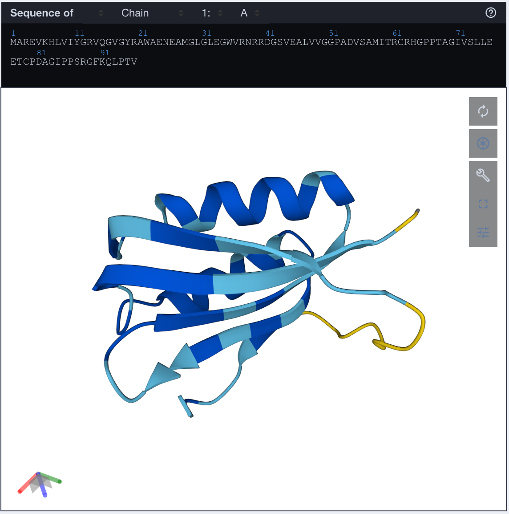

# Simple, hackable protein transformers from scratch 

The goal of this project is to provide a simple, hackable implementation of protein transformer models for education and research. Inspired by Karpathy's simple, hackable approach in the [makemore](https://github.com/karpathy/makemore) series. 

- [Simple, hackable protein transformers on GitHub]()

## Tutorial/walkthrough videos 

In addition to providing the implementation, we also provide a tutorial as a series of lecture videos that walk you through the creation of the dataset, models, training, evaluation, and scaling the protein language model. 

- [Lecture 1 video. Choosing a dataset and framing the problem]()
- [Lecture 2 video. A simple neural network protein language model from scratch]()
- [Lecture 3 video. Building the protein transformer model from scratch]()
- [Lecture 4 video. Evaluating protein language models]()
- [Lecture 5 video. Scaling protein transformers]()


## Protein language model implementation 

In addition to the lecture videos, a reference implementation is available on GitHub. There are three main sections, all implemented in PyTorch:

- protein data loaders and tokenizers
- protein transformer model
- training and evaluating the model

The model architecture is identical to that of GPT-2, except for the embedding dimension since we have a much smaller vocabulary. The code is [substantially based on Andrej Karpathy's implementation in the Makemore series](). In fact, the whole idea for this series is based on [Andrej's amazing lectures]().   


### Protein data loaders 

`ProteinDataset` uses a character-level tokenizer (as used by ESM and all other protein language models I know about). Find the `ProteinDataset` class defined in `data.py`. An example of using the `ProteinDataset` class: 

```python 
# example, some short proteins of length 38 

proteins = [
    "MCLLSLAAATVAARRTPLRLLGRGLAAAMSTAGPLKSV", 
    "MSSQIKKSKTTTKKLVKSAPKSVPNAAADDQIFCCQFE", 
    "MCLLSLAAATVAARRTPLRLLGRGLAAAMSTAGPLKSV", 
]

chars = "ACDEFGHIKLMNPQRSTVWY"

max_length = 38 

dataset = ProteinDataset(proteins, chars, max_length)
```

### Transformer model 

The model implemented here is a standard "decoder-only" transformer architecture
("decoder-only" meaning that we use a triangular mask and ask the model to predict the next token). Following makemore, the implementation is totally spelled out in Python code so we can see all the details. 

- Amino acid tokens are embedded via a learned embedding table 
- Causal multi-head attention is used to update the representation of each token 
- New sequences are made via sampling from the token probabilities 

```python 
config = ModelConfig(vocab_size=20, block_size=3, 
                     n_layer=4, n_head=4, embed_dim=100)
                     
model = Transformer(config)
```

### Training loop 

In the training loop portion of the code, we parse the arguments
from the command line, and then create the Adam optimizer, model
instantiation, and proceed to train the model via backprop. 

Every so often, we evaluate the loss on a subset of the training set and a subset of the test set. Also, we occasionally print out samples from the model. 

- **3-D visualization during model training**. It's fundementally 
  important, I think, to visualize the 3-D structure of proteins
  output by the language model during training. To do this, I use 
  ESMFold (either via `curl` or local install). ESMFold will 
  rapidly (a second or two) fold small proteins like those in the 
  AcyP example dataset so you can easily keep track of the folding
  progress as the model trains 


## Tutorial: training a model from scratch on the AcyP dataset 


### Setting up your compute environment 

To install all the dependencies at once (this is simple enough that I'll skip providing an environment file, but please feel free to open an issue if you have problems and we can update this): 

```
# virtual environment 
python -m venv .venv 
python -m pip install torch biotite plotly 
```

Everything works on CPU, MPS, and CUDA currently. For the videos, I am using the Fish shell and a vanilla Python 3.11 virtual environment. 


### Training from scratch  

To instantiate a new model and train on a FASTA dataset, use the following command line. The example dataset in the repo contains 26,878 homologs of AcyP that are between 64 and 128 residues in length and contain predicted catalytic residue sites from UniProt. 

To train a model on this dataset, use the following command: 

```
python main.py -i hypf.fa -o hypf 
```

Once the model is trained, and you would like to sample (data will be printed in FASTA format):

```
python main.py -i hypf.fa -o hypf --sample-only 
```

### Clustering your input data for better results 

Let's examine how different levels of input clustering change 
the performance of a small transformer model. To do this, let's 
create a small model and then train it on the same dataset, 
clustered to different levels of sequence identity with MMseqs2. 

We'll start with a dataset of HypF homologs that I collected from 
UniProt. See the [preprocessing notebook for details](preprocessing.ipynb). 

Let's cluster the dataset at three different levels: at 100%, 
at 90%, and at 50% sequence identity. This reduces our number of
samples 

```bash 
# create an mmseqs db 
mmseqs createdb hypf.fa DB 

# cluster to 100% identity 
mmseqs cluster -c 1.00 --min-seq-id 1.00 DB clust100 tmp
mmseqs createsubdb clust100 DB rep100
mmseqs convert2fasta rep100 rep100.fa

# 90% identity 
mmseqs cluster -c 0.95 --min-seq-id 0.90 DB clust90 tmp
mmseqs createsubdb clust90 DB rep90 
mmseqs convert2fasta rep90 rep90.fa   

# 50% identity 
mmseqs cluster -c 0.80 --min-seq-id 0.50 DB clust50 tmp
mmseqs createsubdb clust50 DB rep50 
mmseqs convert2fasta rep50 rep50.fa   
```

This provides the following datasets for us to try: 

| Clustering level | Number of sequences 
|------------------|---------------------
| No clustering    | 26,856
| 100% identity    | 23,274
| 90%              | 18,716
| 50%              | 12,383

To establish train/test splits, we'll use the random seed 42, 
and take 10% of the data at random. At the 90% identity level,
that means that, for each protein in the test set, the closest
protein in the training set is 90% identical, at maximum. 

We'll use a small transformer model, with an embedding size of 64, 
with 4 layers and 4 heads, and we'll train for 75k steps. Each 
step will be a minibatch of size 32, with a block size of 128 
sampled randomly from the training set. 

Here is what the training and test loss looks like for the three
clusters 100%, 90%, and 50%, just a screenshot of the Tensorboard
instance. 


This brings me to an important point, which is the importance of clustering your data when working with protein sequences. Here, we can see that while the train loss looks fine for each of the three training runs, at the 50% level, while the training loss goes to under 1.4, the test loss never goes below 1.6, and according to the test loss, the model has stopped learning around step 10k. 

The correct level of clustering is an important hyperparameter when training sequence-based models such as this decoder-only transformer model trained on the HypF dataset. 

### Folding some generated proteins 

Just for fun, let's generate a couple of samples and fold them. 
I picked this sample from the last checkpoint 

```
>sample
MAREVKHLVIYGRVQGVGYRAWAENEAMGLGLEGWVRNRRDGSVEALVVGGPADVSAMITRCRHGPPTAGIVSLLEETCPDAGIPPSRGFKQLPTV
```

and [folded it with ESMFold](), and obtained this structure



I then was interested to compare this to a crystal structure of 
a homolog from the family. The crystal structure PDB code 1URR 
is "novel _Drosophila melanogaster_ acylphosphatase" (Zuccotti+ 2004). 

I found that the generated protein is only about 25% identical, 
at a primary sequence level, to the sequence from 1URR. However, 
after structural alignment in PyMOL, we can see that not only is 
the generated sequence predicted to fold into the same overall fold
as the real sequence from 1URR, but also both catalytic residues 
are present and the correct identity (in the crystal, these are 
R27 and N45). 


**Superposition of generated protein 
and crystal structure.** The crystal, in **gray**, is a acylphosphatase from _Drosophila melanogaster_ with PDB code 1URR. The generated protein, as folded by ESMFold, is depicted <span style="color:purple;">purple</span>. Figure drawn with PyMOL. 
